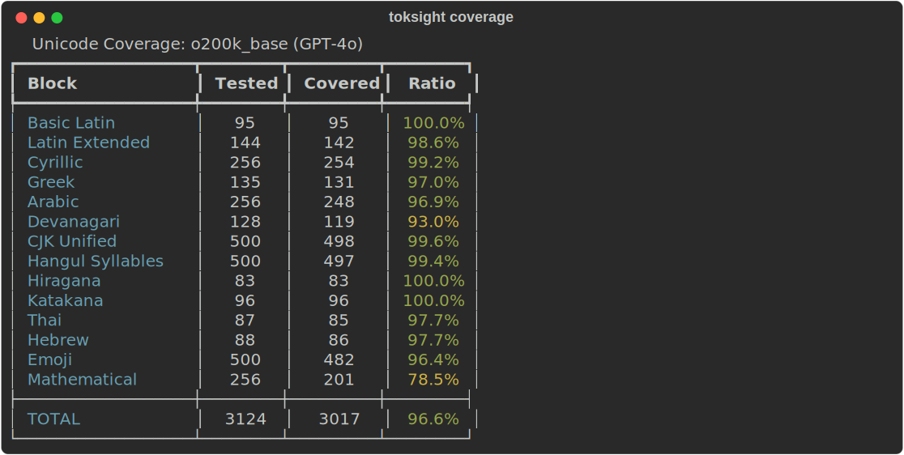
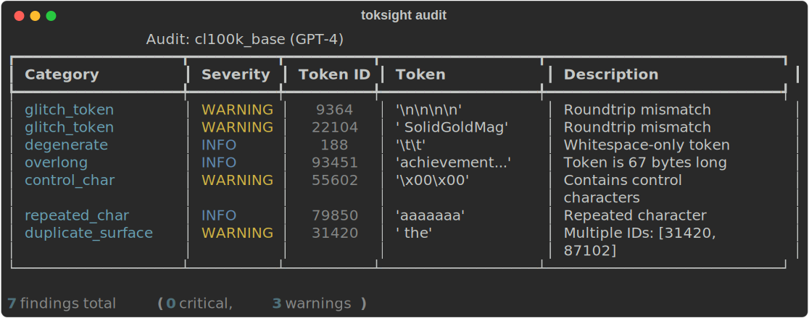

# toksight

[](https://github.com/stef41/toksight/actions/workflows/ci.yml)
[](https://www.python.org/downloads/)
[](https://opensource.org/licenses/Apache-2.0)

Tokenizer analysis toolkit. Compare vocabulary coverage, compression ratios, and token boundaries across GPT-4o, Llama 3, Mistral, and any HuggingFace tokenizer.

<p align="center">
  
</p>

## Why toksight?

Every LLM developer interacts with tokenizers daily — for cost estimation, multilingual planning, context window budgeting — yet there is **zero tooling** for analyzing or comparing them. tiktoken, sentencepiece, and tokenizers are *implementations*; toksight is the *microscope*.

| Question | Before toksight | With toksight |
|---|---|---|
| "How does GPT-4o handle Korean vs Llama 3?" | Manual guessing | `toksight coverage --blocks Hangul` |
| "What's the vocabulary overlap?" | Nobody knows | `toksight compare gpt-4o llama3` |
| "How much more expensive is this corpus on GPT-4 vs Claude?" | Manual counting | `toksight cost --corpus data.txt` |
| "Does this tokenizer have glitch tokens?" | Run each token manually | `toksight audit gpt-4o` |

## Install

```bash
pip install toksight
```

With tokenizer backends:

```bash
pip install toksight[tiktoken]       # OpenAI tokenizers
pip install toksight[transformers]   # HuggingFace tokenizers
pip install toksight[all]            # Everything
pip install toksight[cli]            # CLI tools
```

## Quick Start

### Compression Analysis

```python
from toksight import load_tiktoken
from toksight.compression import compute_compression

tok = load_tiktoken("cl100k_base")
stats = compute_compression(tok, ["Hello world! This is a test."])
print(f"Bytes/token: {stats.bytes_per_token:.2f}")
print(f"Fertility:   {stats.fertility:.2f} tokens/word")
```

### Unicode Coverage

```python
from toksight.coverage import analyze_coverage

result = analyze_coverage(tok, blocks=["CJK Unified", "Hangul Syllables", "Arabic"])
for block, info in result.blocks_analyzed.items():
    print(f"{block}: {info['ratio']:.1%} coverage")
```

### Vocabulary Comparison

```python
from toksight.compare import compare_vocabularies, compare_on_corpus

tok_a = load_tiktoken("cl100k_base")   # GPT-4
tok_b = load_tiktoken("o200k_base")    # GPT-4o

result = compare_vocabularies(tok_a, tok_b)
print(f"Overlap:  {result.vocab_overlap:,} tokens")
print(f"Jaccard:  {result.jaccard_similarity:.2%}")
```

<p align="center">
  
</p>

### Token Mapping

```python
from toksight.mapping import map_tokens

mapping = map_tokens(tok_a, tok_b, "Artificial intelligence is transforming healthcare")
for entry in mapping:
    src = entry["source_token"]
    targets = [t["text"] for t in entry["target_tokens"]]
    print(f"  {src!r} → {targets}")
```

### Tokenizer Audit

```python
from toksight.audit import audit

result = audit(tok)
for finding in result.findings[:10]:
    print(f"[{finding.severity}] {finding.category}: {finding.description}")
```

### Cost Estimation

```python
from toksight.cost import compare_costs

corpus = ["Long document text..."] * 1000
costs = compare_costs(
    [(tok_a, "gpt-4o"), (tok_b, "gpt-4o-mini")],
    corpus,
)
for name, est in costs.estimates.items():
    print(f"{name}: {est['total_tokens']:,} tokens, ${est['input_cost_usd']:.4f}")
```

## CLI

```bash
# Vocabulary stats
toksight info cl100k_base

# Compression analysis
toksight compress cl100k_base --corpus data.txt

# Unicode coverage
toksight coverage cl100k_base

# Tokenizer audit
toksight audit cl100k_base --max-tokens 5000
```

## Modules

| Module | Purpose |
|---|---|
| `toksight.loader` | Unified tokenizer loading (tiktoken, HuggingFace, SentencePiece, custom) |
| `toksight.compression` | Compression ratios, bytes/token, fertility analysis |
| `toksight.coverage` | Unicode block coverage, script analysis, roundtrip testing |
| `toksight.compare` | Vocabulary overlap, boundary alignment, fragmentation mapping |
| `toksight.mapping` | Token-to-token mapping between tokenizers |
| `toksight.audit` | Glitch token detection, degenerate tokens, control chars |
| `toksight.cost` | Provider cost estimation from tokenization differences |
| `toksight.stats` | Vocabulary statistics, length distributions, script coverage |

## Supported Backends

| Backend | Install | Tokenizers |
|---|---|---|
| **tiktoken** | `pip install toksight[tiktoken]` | cl100k_base (GPT-4), o200k_base (GPT-4o) |
| **HuggingFace** | `pip install toksight[transformers]` | Any model on HuggingFace Hub |
| **SentencePiece** | `pip install toksight[sentencepiece]` | Any .model file |
| **Custom** | Built-in | Any encode/decode functions |

## See Also

Part of the **stef41 LLM toolkit** — open-source tools for every stage of the LLM lifecycle:

| Project | What it does |
|---------|-------------|
| [tokonomics](https://github.com/stef41/tokonomix) | Token counting & cost management for LLM APIs |
| [datacrux](https://github.com/stef41/datacruxai) | Training data quality — dedup, PII, contamination |
| [castwright](https://github.com/stef41/castwright) | Synthetic instruction data generation |
| [datamix](https://github.com/stef41/datamix) | Dataset mixing & curriculum optimization |
| [trainpulse](https://github.com/stef41/trainpulse) | Training health monitoring |
| [ckpt](https://github.com/stef41/ckptkit) | Checkpoint inspection, diffing & merging |
| [quantbench](https://github.com/stef41/quantbenchx) | Quantization quality analysis |
| [infermark](https://github.com/stef41/infermark) | Inference benchmarking |
| [modeldiff](https://github.com/stef41/modeldiffx) | Behavioral regression testing |
| [vibesafe](https://github.com/stef41/vibesafex) | AI-generated code safety scanner |
| [injectionguard](https://github.com/stef41/injectionguard) | Prompt injection detection |

## License

Apache-2.0
